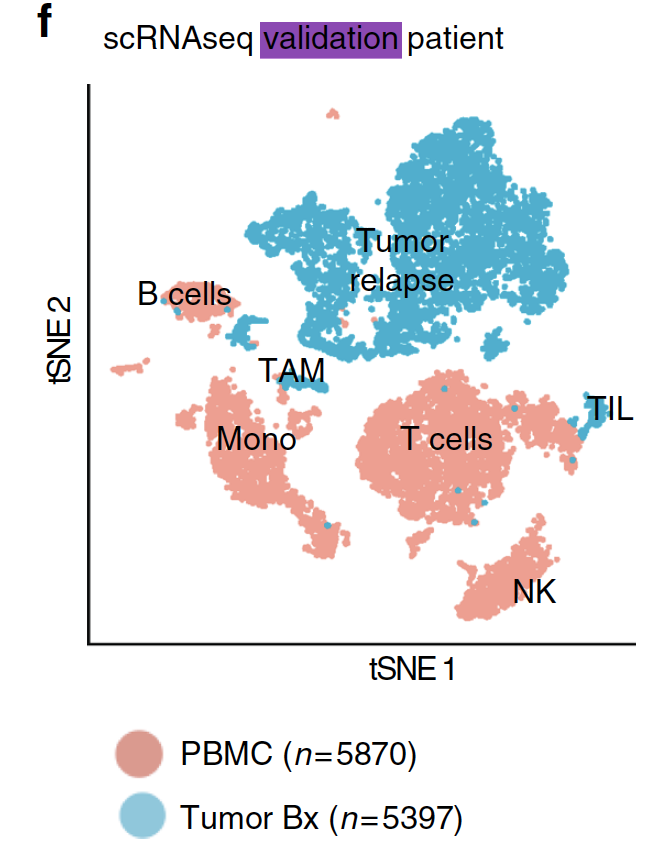
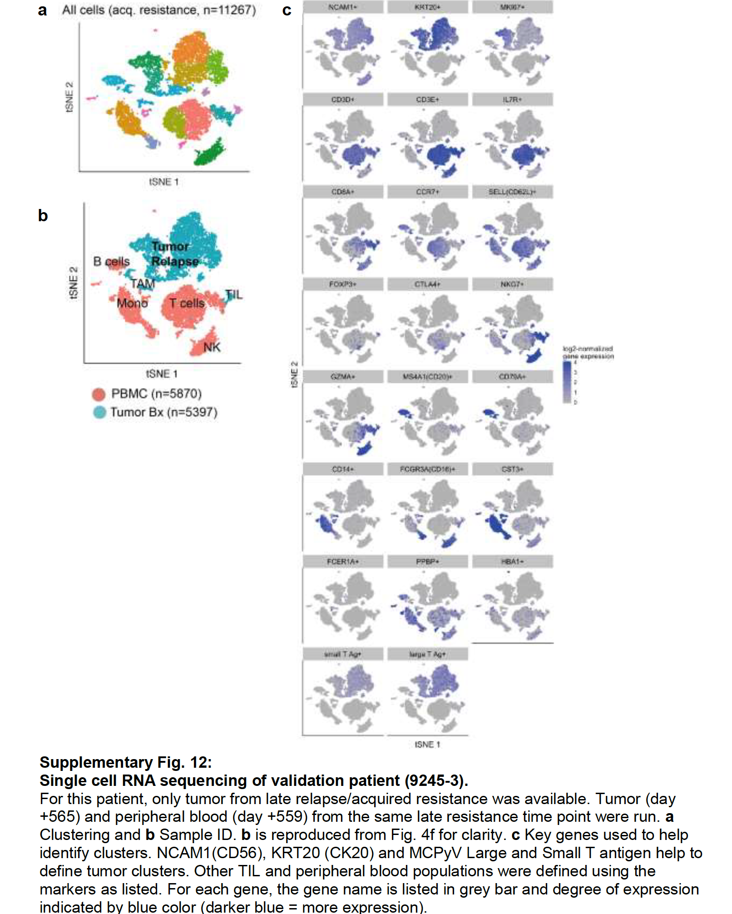

```{r setup, include=FALSE}
knitr::opts_chunk$set(echo = TRUE)
knitr::opts_chunk$set(warning = F)
knitr::opts_chunk$set(message  = F) 
```

## 引言

这里直接读取作者给定的第2个病人的 Gene expression analysis: validation patient，用的是 10x Genomics 5’ V(D)J  平台测序.

是 25066 genes across 11071 samples.

## 载入必要的R包

需要自行下载安装一些必要的R包！ 而且需要注意版本 Seurat 

因为大量学员在中国大陆，通常不建议大家使用下面的R包安装方法，建议是切换镜像后再下载R包。

参考：http://www.bio-info-trainee.com/3727.html


```{r,eval=FALSE}
# 下面代码不运行。
# Enter commands in R (or R studio, if installed)
# Install the devtools package from Hadley Wickham
install.packages('devtools')
# Replace '2.3.0' with your desired version
devtools::install_version(package = 'Seurat', version = package_version('2.3.0'))

library(Seurat)
```

加载R包

```{r}
rm(list = ls()) # clear the environment
#load all the necessary libraries
options(warn=-1) # turn off warning message globally
suppressMessages(library(Seurat))

```

## 读入文章关于第2个病人的全部表达矩阵

```{r}
start_time <- Sys.time()
# 如果觉得这里较慢，可以使用 data.table 包的 fread函数。
raw_data <- read.csv('../Output_2018-03-12/GSE118056_raw.expMatrix.csv.gz', header = TRUE, row.names = 1)
end_time <- Sys.time()
end_time - start_time
# 通常电脑一分钟可以搞定。

dim(raw_data) # 11,071 cells and 25,066 genes - already filtered

data <- log2(1 + sweep(raw_data, 2, median(colSums(raw_data))/colSums(raw_data), '*')) # Normalization
cellTypes <- sapply(colnames(data), function(x) ExtractField(x, 2, '[.]'))

cellTypes <- ifelse(cellTypes == '1', 'PBMC', 'Tumor')
table(cellTypes)
```

## 表达矩阵的质量控制

简单看看表达矩阵的性质，主要是基因数量，细胞数量;以及每个细胞表达基因的数量，和每个基因在多少个细胞里面表达。

```{r}
# 可以看到, 2万多的基因里面，
# 绝大部分基因只在一万多细胞的至少200个是表达的
fivenum(apply(data,1,function(x) sum(x>0) ))
boxplot(apply(data,1,function(x) sum(x>0) ))

# 可以看到，一万多细胞里面
# 绝大部分细胞可以检测到2000个以上的基因。
fivenum(apply(data,2,function(x) sum(x>0) ))
hist(apply(data,2,function(x) sum(x>0) ))
```

## 然后创建Seurat的对象

```{r}
start_time <- Sys.time()
# Create Seurat object
seurat <- CreateSeuratObject(raw.data = data, project = '10x_MCC_2') # already normalized
dim(data)
seurat # 25,066 genes and 11,071 cells
# 可以看到上面创建Seurat对象的那些参数并没有过滤基因或者细胞。


# Add meta.data (nUMI and cellTypes)
seurat <- AddMetaData(object = seurat, metadata = apply(raw_data, 2, sum), col.name = 'nUMI_raw')
seurat <- AddMetaData(object = seurat, metadata = cellTypes, col.name = 'cellTypes')

```

## 一些质控

这里绘图，可以指定分组，前提是这个分组变量存在于meta信息里面，我们创建对象后使用函数添加了 cellTypes 属性，所以可以用来进行可视化。

这里是：'cellTypes'，就是PMBC和tumor的区别

```{r}
sce=seurat
VlnPlot(object = sce, 
        features.plot = c("nGene", "nUMI"), 
        group.by = 'cellTypes', nCol = 2)
GenePlot(object = sce, gene1 = "nUMI", gene2 = "nGene")

```

可以看看高表达量基因是哪些

```{r}
tail(sort(Matrix::rowSums(sce@raw.data)))
## 散点图可视化任意两个基因的一些属性（通常是细胞的度量）
# 这里选取两个基因。
tmp=names(sort(Matrix::rowSums(sce@raw.data),decreasing = T))
GenePlot(object = sce, gene1 = tmp[1], gene2 = tmp[2])

# 散点图可视化任意两个细胞的一些属性（通常是基因的度量）
# 这里选取两个细胞
CellPlot(sce,sce@cell.names[3],sce@cell.names[4],do.ident = FALSE)

```

## 最后标准聚类可视化
 
```{r}
start_time <- Sys.time()
# 最耗费时间的步骤在这里。
seurat <- ScaleData(object = seurat, vars.to.regress = c('nUMI_raw'), model.use = 'linear', use.umi = FALSE)
end_time <- Sys.time()
end_time - start_time


seurat <- FindVariableGenes(object = seurat, 
                            mean.function = ExpMean,
                            dispersion.function = LogVMR, 
                            x.low.cutoff = 0.05, 
                            x.high.cutoff = 4, 
                            y.cutoff = 0.5)
head(seurat@var.genes)
length(seurat@var.genes)

# 这里使用的pcs.compute 比前面两个要多。
seurat <- RunPCA(object = seurat, 
                 pc.genes = seurat@var.genes, 
                 pcs.compute = 40)

seurat <- RunTSNE(object = seurat, dims.use = 1:10, perplexity = 50, do.fast = TRUE) 

start_time <- Sys.time()
## 避免太多log日志被打印出来。
seurat <- FindClusters(object = seurat, 
                       reduction.type = 'pca', 
                       dims.use = 1:10, 
                       resolution = 0.6, 
                       print.output = 0,
                      k.param = 20, 
                      save.SNN = TRUE)


TSNEPlot(seurat, group.by = 'cellTypes')
TSNEPlot(seurat,group.by = "ident",pt.shape ='cellTypes') 
end_time <- Sys.time()
end_time - start_time
```


## 输出seurat结果后面使用

```{r}

start_time <- Sys.time()
save(seurat,file = 'patient2.seurat.output.Rdata')
end_time <- Sys.time()
end_time - start_time
# 这个步骤会输出文件  
```


实际上最后的图也需要标记细胞类群，文章如下：


作者使用的marker基因列表也可以在文章附件找到，如下：


## 显示运行环境

```{r}
sessionInfo()
```


