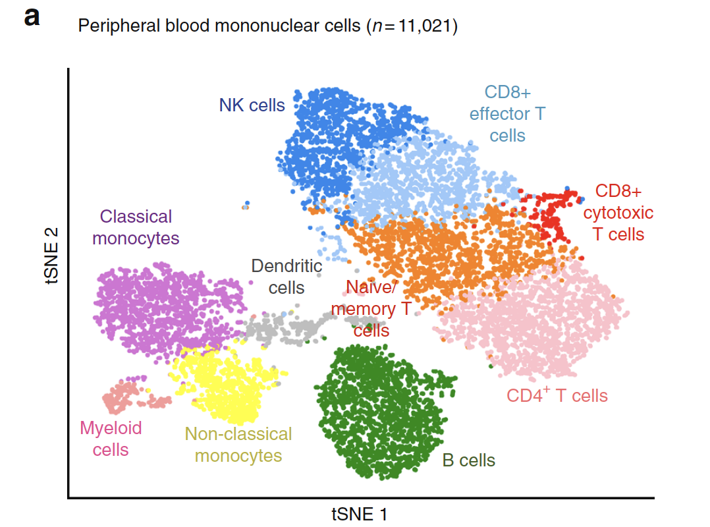
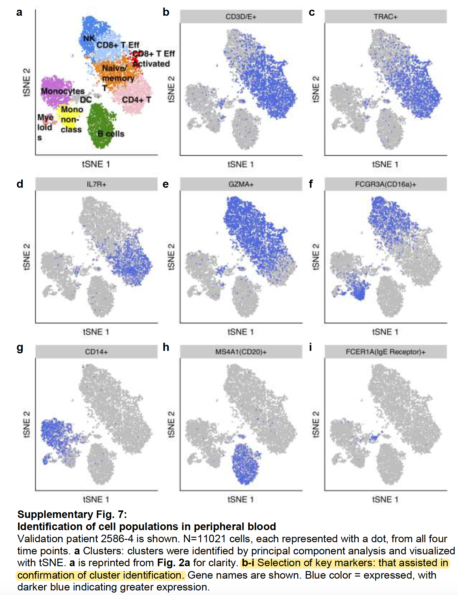

```{r setup, include=FALSE}
knitr::opts_chunk$set(echo = TRUE)
knitr::opts_chunk$set(warning = F)
knitr::opts_chunk$set(message  = F) 
```

## 引言

这里直接读取作者给定的第一个病人的Gene expression analysis: discovery patient PBMC，用的是 10x genomics 3' Chromium expression assay

Following sequence alignment and filtering, a total of 12,874 cells were analyzed. 

最后是 17,712 genes and 12,874 cells

## 载入必要的R包

需要自行下载安装一些必要的R包！ 而且需要注意版本 Seurat 

因为大量学员在中国大陆，通常不建议大家使用下面的R包安装方法，建议是切换镜像后再下载R包。

参考：http://www.bio-info-trainee.com/3727.html


```{r}
if (!requireNamespace("BiocManager"))
    install.packages("BiocManager")
if (!requireNamespace("Seurat"))
    BiocManager::install("Seurat")
```

加载R包

```{r}
rm(list = ls()) # clear the environment
#load all the necessary libraries
options(warn=-1) # turn off warning message globally
suppressMessages(library(Seurat))

```

## 读入文章关于第一个病人的PBMC表达矩阵

```{r}
start_time <- Sys.time()
raw_dataPBMC <- read.csv('../Output_2018-03-12/GSE117988_raw.expMatrix_PBMC.csv.gz', header = TRUE, row.names = 1)
end_time <- Sys.time()
end_time - start_time # for 2.7 GHz i5, 8G RAM, total = 4min

dim(raw_dataPBMC) 

start_time <- Sys.time()
dataPBMC <- log2(1 + sweep(raw_dataPBMC, 2, median(colSums(raw_dataPBMC))/colSums(raw_dataPBMC), '*')) # Normalization
end_time <- Sys.time()
end_time - start_time

# 3.0版本取消了ExtractField
# 版本2 timePoints <- sapply(colnames(dataPBMC), function(x) ExtractField(x, 2, '[.]'))
timePoints <- sapply(colnames(dataPBMC), function(x) unlist(strsplit(x, "\\."))[2]) 

timePoints <-ifelse(timePoints == '1', 'PBMC_Pre', 
                    ifelse(timePoints == '2', 'PBMC_EarlyD27',
                           ifelse(timePoints == '3', 'PBMC_RespD376', 'PBMC_ARD614')))
table(timePoints)
```

## 表达矩阵的质量控制

简单看看表达矩阵的性质，主要是基因数量，细胞数量;以及每个细胞表达基因的数量，和每个基因在多少个细胞里面表达。

```{r}
fivenum(apply(dataPBMC,1,function(x) sum(x>0) ))
boxplot(apply(dataPBMC,1,function(x) sum(x>0) ))
fivenum(apply(dataPBMC,2,function(x) sum(x>0) ))
hist(apply(dataPBMC,2,function(x) sum(x>0) ))
```

## 然后创建Seurat的对象

```{r}
start_time <- Sys.time()
# 3.0版本Create Seurat object稍作改进
PBMC <- CreateSeuratObject(dataPBMC, 
                           min.cells = 1, min.features = 0, 
                           project = '10x_PBMC') # already normalized
PBMC # 17,712 genes and 12,874 cells
end_time <- Sys.time()
end_time - start_time 

# Add meta.data (nUMI and timePoints)
# 3.0版本可以直接使用 object$name <- vector，当然也可以用AddMetaData
PBMC <- AddMetaData(object = PBMC, 
                    metadata = apply(raw_dataPBMC, 2, sum),
                    col.name = 'nUMI_raw')
PBMC <- AddMetaData(object = PBMC, metadata = timePoints, col.name = 'TimePoints')

```

## 一些质控

这里绘图，可以指定分组，前提是这个分组变量存在于meta信息里面，我们创建对象后使用函数添加了 TimePoints 属性，所以可以用来进行可视化。

这里是：'TimePoints'

```{r}
sce=PBMC
features=c("nFeature_RNA", "nUMI_raw")
VlnPlot(object = sce, 
        features = features, 
        group.by = 'TimePoints', ncol = 2)

# 3.0版本将GenePlot替换为FeatureScatter
# 版本2 GenePlot(object = sce, gene1 = "nUMI", gene2 = "nGene")
FeatureScatter(sce,feature1 = "nUMI_raw",feature2 = "nFeature_RNA")
```

可以看看高表达量基因是哪些

```{r}
# 3.0版本要将sce@raw.data替换成GetAssayData(object = , assay= ,slot = )
tail(sort(Matrix::rowSums(GetAssayData(sce,assay = "RNA"))))
## 散点图可视化任意两个基因的一些属性（通常是细胞的度量）
# 这里选取两个基因。
tmp=names(sort(Matrix::rowSums(GetAssayData(sce,assay = "RNA")),decreasing = T))
# 版本2 GenePlot(object = sce, gene1 = tmp[1], gene2 = tmp[2])
FeatureScatter(object = sce, feature1 = tmp[1], feature2 = tmp[2])

# 散点图可视化任意两个细胞的一些属性（通常是基因的度量）
# 这里选取两个细胞

# 3.0版本将CellPlot替换成CellScatter，sce@cell.names换为colnames
# 版本2 CellPlot(sce,sce@cell.names[3],sce@cell.names[4],do.ident = FALSE)
CellScatter(sce, colnames(sce)[3],colnames(sce)[4])
```

## 最后标准聚类可视化

This process consists of data normalization and variable feature selection, data scaling, a PCA on variable features, construction of a shared-nearest-neighbors graph, and clustering using a modularity optimizer. Finally, we use a t-SNE to visualize our clusters in a two-dimensional space.

```{r}
start_time <- Sys.time()
# Cluster PBMC
PBMC <- ScaleData(object = PBMC, vars.to.regress = c('nUMI_raw'), model.use = 'linear', use.umi = FALSE)
# 3.0版本将FindVariableGenes换为FindVariableFeatures，另外将原来的cutoff进行整合，x轴统一归到mean.cutoff中，y轴归到dispersion.cutoff中
# 版本2 PBMC <- FindVariableGenes(object = PBMC, mean.function = ExpMean, dispersion.function = LogVMR, x.low.cutoff = 0.0125, x.high.cutoff = 3, y.cutoff = 0.5)

PBMC <- FindVariableFeatures(object = PBMC, mean.function = ExpMean, dispersion.function = LogVMR, mean.cutoff = c(0.0125,3), dispersion.cutoff = c(0.5,Inf))

PBMC <- RunPCA(object = PBMC, pc.genes = VariableFeatures(PBMC))

## 避免太多log日志被打印出来。

# 3.0版本将FindClusters拆分为FindNeighbors和FindClusters
# 版本2是一个函数
# PBMC <- FindClusters(object = PBMC, 
#                      reduction.type = "pca", 
#                      dims.use = 1:10, 
#                      resolution = 1, 
#                      print.output = 0,
#                      k.param = 35, save.SNN = TRUE) # 13 clusters

PBMC <- FindNeighbors(PBMC, reduction = "pca", dims = 1:10,
                      k.param = 35)
PBMC <- FindClusters(object = PBMC, 
                     resolution = 1, verbose=F) 

PBMC <- RunTSNE(object = PBMC, dims.use = 1:10)

DimPlot(PBMC, colors = c('green4', 'pink', '#FF7F00', 'orchid', '#99c9fb', 'dodgerblue2', 'grey30', 'yellow', 'grey60', 'grey', 'red', '#FB9A99', 'black'))
end_time <- Sys.time()
end_time - start_time # for 2.7 GHz i5, 8G RAM, total = 1.2h

save(PBMC,file = 'patient1.PBMC.output.Rdata')
# 这个步骤输出文件 1.75G, 遂放弃！
```

最后，这 13 clusters要进行注释，才能发表，如下所示：


作者文章里面是Representative marker genes shown in Supplementary Fig. 7. 如下所示



可以看到作者对PBMC里面的细胞都挑选了一个基因就命名了。

## 显示运行环境

```{r}
sessionInfo()
```


