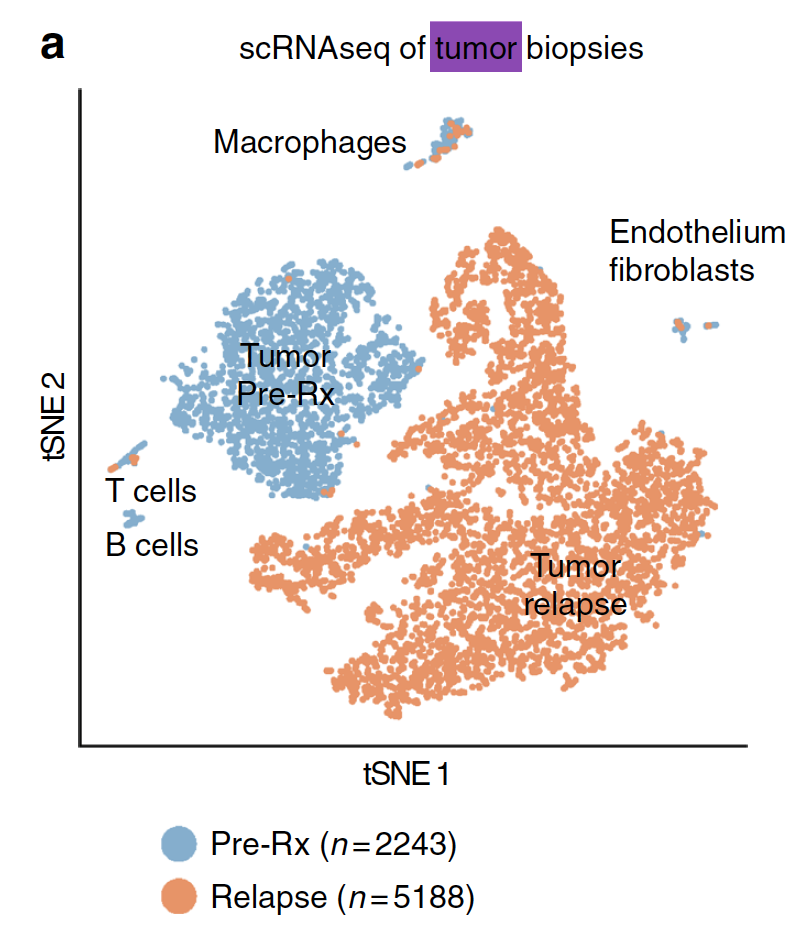
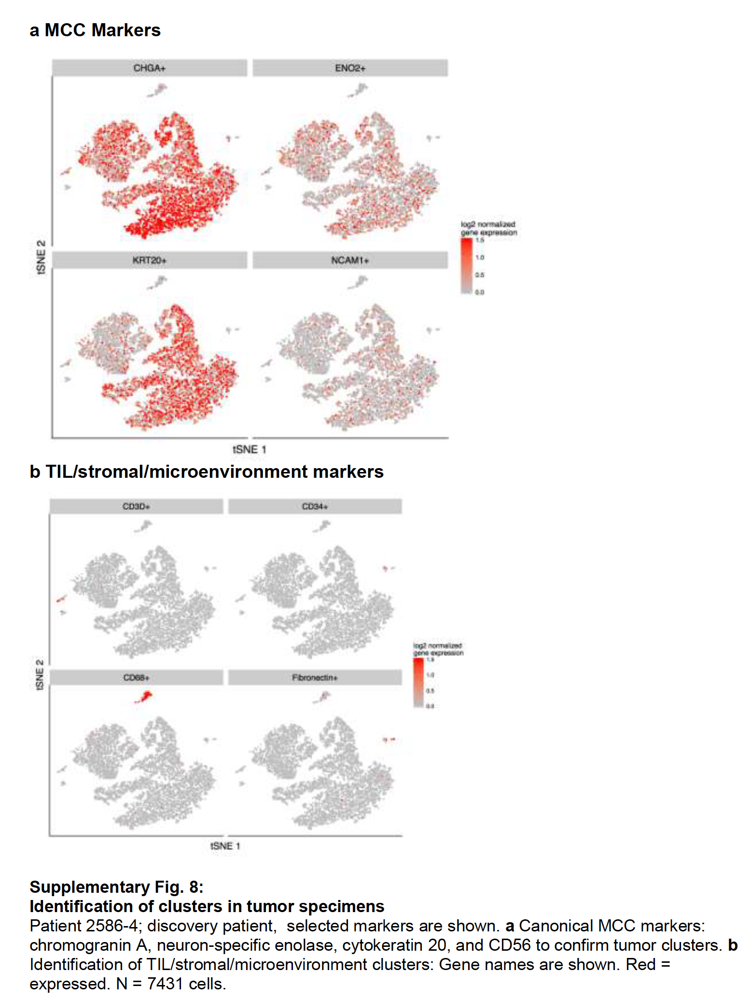

```{r setup, include=FALSE}
knitr::opts_chunk$set(echo = TRUE)
knitr::opts_chunk$set(warning = F)
knitr::opts_chunk$set(message  = F) 
```

## 引言

这里直接读取作者给定的第一个病人的Gene expression analysis: discovery patient tumor，用的是 10x genomics 3' Chromium expression assay.

Following sequence alignment and filtering, a total of 7431 tumor cells  

主要是比较免疫治疗前后的肿瘤细胞的免疫变化，免疫治疗前有2243 cells ，免疫治疗后是3个时间点，细胞数量多一点，是5188 cells


## 载入必要的R包

需要自行下载安装一些必要的R包！ 而且需要注意版本 Seurat 

因为大量学员在中国大陆，通常不建议大家使用下面的R包安装方法，建议是切换镜像后再下载R包。

参考：http://www.bio-info-trainee.com/3727.html


```{r}
if (!requireNamespace("BiocManager"))
    install.packages("BiocManager")
if (!requireNamespace("Seurat"))
    BiocManager::install("Seurat")
```

加载R包

```{r}
rm(list = ls()) # clear the environment
#load all the necessary libraries
options(warn=-1) # turn off warning message globally
suppressMessages(library(Seurat))

```

## 读入文章关于第一个病人的tumor表达矩阵

```{r}
start_time <- Sys.time()
raw_dataTumor <- read.csv('../Output_2018-03-12/GSE117988_raw.expMatrix_Tumor.csv.gz', header = TRUE, row.names = 1)
end_time <- Sys.time()
end_time - start_time # for 2.7 GHz i5, 8G RAM, total = 1.8min

dim(raw_dataTumor) # 7,431 cells and 21,861 genes - already filtered
dataTumor <- log2(1 + sweep(raw_dataTumor, 2, median(colSums(raw_dataTumor))/colSums(raw_dataTumor), '*')) # Normalization

# 3.0版本取消了ExtractField
# 版本2 cellTypes <- sapply(colnames(dataTumor), function(x) ExtractField(x, 2, '[.]'))

cellTypes <- sapply(colnames(dataTumor), function(x) unlist(strsplit(x, "\\."))[2]) 
cellTypes <-ifelse(cellTypes == '1', 'Tumor_Before', 'Tumor_AcquiredResistance')
table(cellTypes) 
## 实际上原文里面的不仅仅是治疗前后的比较，还有治疗期间的3个时间点。
```

## 表达矩阵的质量控制

简单看看表达矩阵的性质，主要是基因数量，细胞数量;以及每个细胞表达基因的数量，和每个基因在多少个细胞里面表达。

```{r}
fivenum(apply(dataTumor,1,function(x) sum(x>0) ))
boxplot(apply(dataTumor,1,function(x) sum(x>0) ))
fivenum(apply(dataTumor,2,function(x) sum(x>0) ))
hist(apply(dataTumor,2,function(x) sum(x>0) ))
```

## 然后创建Seurat的对象

```{r}
# Create Seurat object
# 与2.0版本对比
# tumor <- CreateSeuratObject(raw.data = dataTumor, min.cells = 1, min.genes = 0, project = '10x_Tumor')
tumor <- CreateSeuratObject(dataTumor, min.cells = 1, min.features = 0, project = '10x_Tumor') # already normalized
tumor # 21,861 genes and 7,431 cells

# Add meta.data (nUMI and cellTypes)
# 3.0版本可以直接使用 object$name <- vector，当然也可以用AddMetaData
tumor <- AddMetaData(object = tumor, 
                     metadata = apply(raw_dataTumor, 2, sum), 
                     col.name = 'nUMI_raw')
tumor <- AddMetaData(object = tumor, metadata = cellTypes, col.name = 'cellTypes')

```

## 一些质控

这里绘图，可以指定分组，前提是这个分组变量存在于meta信息里面，我们创建对象后使用函数添加了 cellTypes 属性，所以可以用来进行可视化。

这里是：'cellTypes'，就是免疫治疗前后。

```{r}
sce=tumor
features=c("nFeature_RNA", "nUMI_raw")
VlnPlot(object = sce, 
        features = features, 
        group.by = 'cellTypes', ncol = 2)

# 3.0版本将GenePlot替换为FeatureScatter
# 版本2 GenePlot(object = sce, gene1 = "nUMI", gene2 = "nGene")
FeatureScatter(sce,feature1 = "nUMI_raw",feature2 = "nFeature_RNA")

```

可以看看高表达量基因是哪些

```{r}
# 3.0版本要将sce@raw.data替换成GetAssayData(object = , assay= ,slot = )
tail(sort(Matrix::rowSums(GetAssayData(sce,assay = "RNA"))))
## 散点图可视化任意两个基因的一些属性（通常是细胞的度量）
# 这里选取两个基因。
tmp=names(sort(Matrix::rowSums(GetAssayData(sce,assay = "RNA")),decreasing = T))
# 版本2 GenePlot(object = sce, gene1 = tmp[1], gene2 = tmp[2])
FeatureScatter(object = sce, feature1 = tmp[1], feature2 = tmp[2])

# 散点图可视化任意两个细胞的一些属性（通常是基因的度量）
# 这里选取两个细胞

# 3.0版本将CellPlot替换成CellScatter，sce@cell.names换为colnames
# 版本2 CellPlot(sce,sce@cell.names[3],sce@cell.names[4],do.ident = FALSE)
CellScatter(sce, colnames(sce)[3],colnames(sce)[4])

```


## 最后标准聚类可视化

```{r}
start_time <- Sys.time()
# Cluster tumor cells
tumor <- ScaleData(object = tumor, vars.to.regress = c('nUMI_raw'), model.use = 'linear', use.umi = FALSE)

# 3.0版本将FindVariableGenes换为FindVariableFeatures，另外将原来的cutoff进行整合，x轴统一归到mean.cutoff中，y轴归到dispersion.cutoff中
# 版本2 tumor <- FindVariableGenes(object = tumor, mean.function = ExpMean, dispersion.function = LogVMR, x.low.cutoff = 0.0125, x.high.cutoff = 3, y.cutoff = 0.5)
tumor <- FindVariableFeatures(object = tumor, mean.function = ExpMean, dispersion.function = LogVMR, mean.cutoff = c(0.0125,3), dispersion.cutoff = c(0.5,Inf))

tumor <- RunPCA(object = tumor, pc.genes = VariableFeatures(tumor))

tumor <- RunTSNE(object = tumor, dims.use = 1:10, perplexity = 25)
DimPlot(tumor, group.by = 'cellTypes', colors.use = c('#EF8A62', '#67A9CF'))

end_time <- Sys.time()
end_time - start_time  # for 2.7 GHz i5, 8G RAM, total = 48.37729
#  这里文章里面没有运行 FindClusters ，仅仅是使用 cellTypes
```

同样的，也是需要marker基因来把肿瘤细胞进行分类，最后文章效果图是：



需要的marker基因也是附件，如下：



## 显示运行环境

```{r}
sessionInfo()
```


